# Arduino SIM900 GPRS GSM Shield example - gate controller
Opening gates and door using mobile calls and SMS messages.

  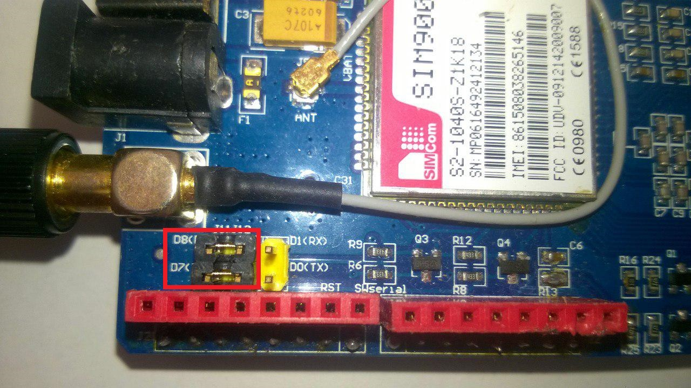
  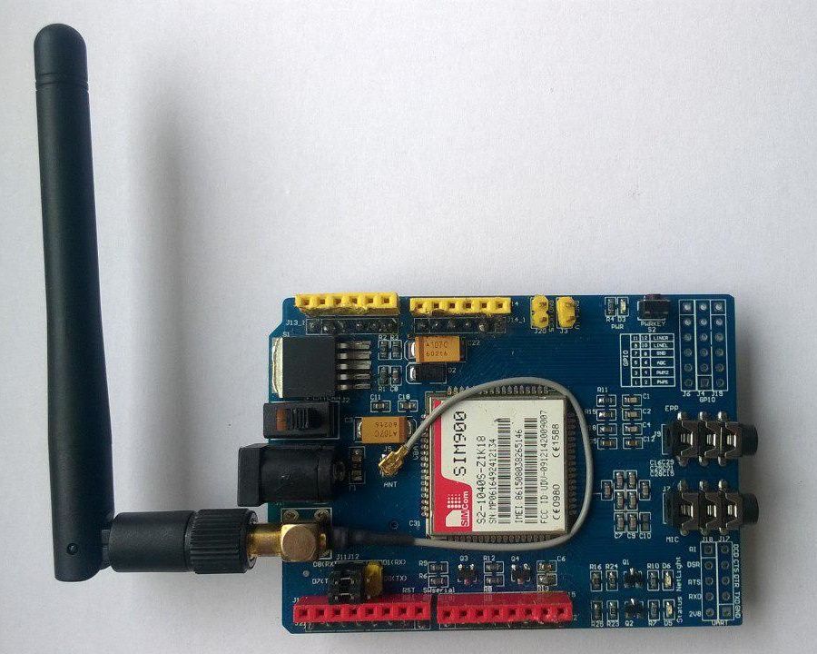

## Setup
<ol>
  <li>Turn off the PIN lock on the SIM card (with a mobile phone)</li>
  <li>Choose TX and RX connections to the Arduino (I use software serial by placing the jumper caps on the left side of the serial selector. TX = D7, RX = D8)
     
  </li>
  <li>Solder R13 connections on the shield together (now you can automatically turn on/off the shield using arduino - GSM shield pin D9)
     
     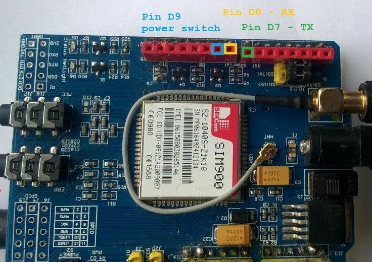
  </li>
  <li>Select the external power source with the toggle switch next to the DC jack (inner side - External power source/outter side - Power from Arduino shield)
     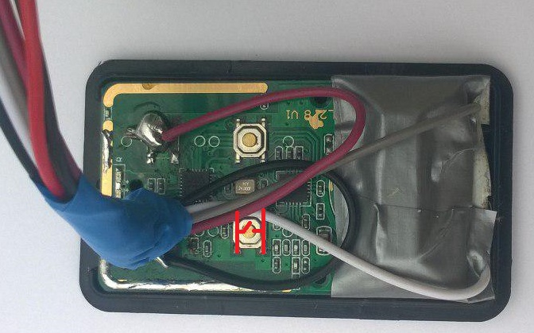
  </li>
  <li>Insert the SIM card into the SIM card holder</li>
  <li>Put GSM shield on the Arduino
     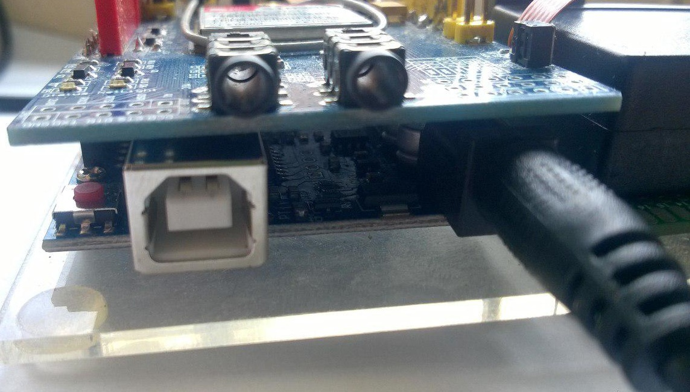
  </li>
  <li>Modify your Gate controller (replace the buttons with wires from relays):
     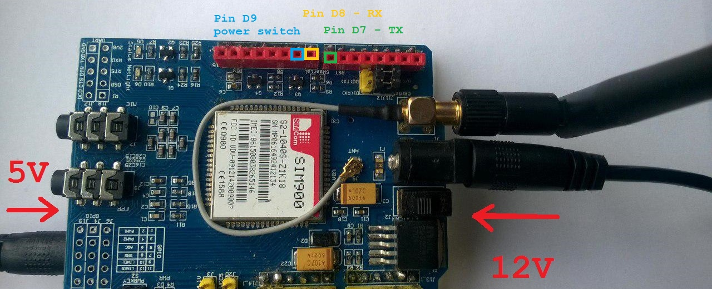
     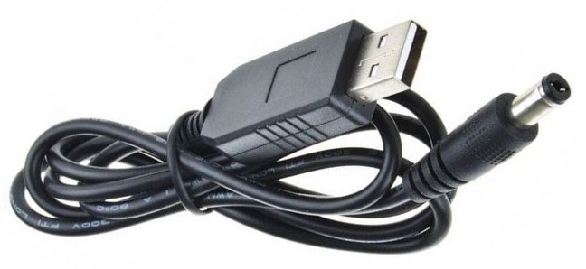
     I also connected gate controller to the physical buttons:
     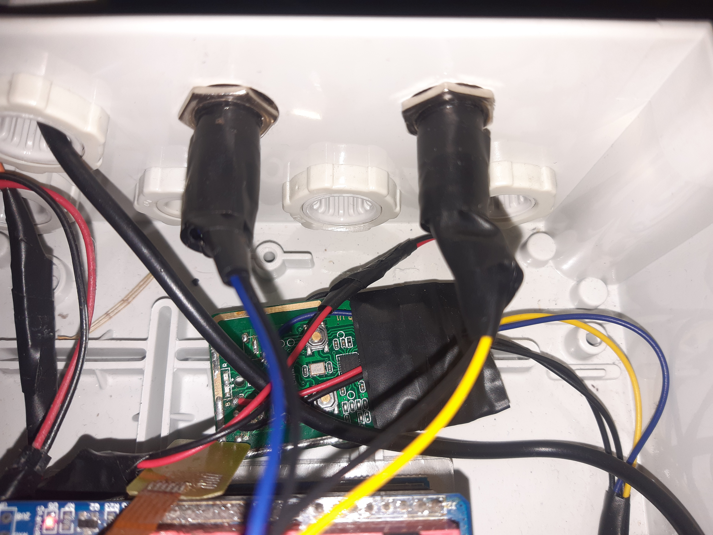
  </li>
  <li>Powering
     I had some problems with low power so I end up with 5 Volt 2 Amp USB charger.
     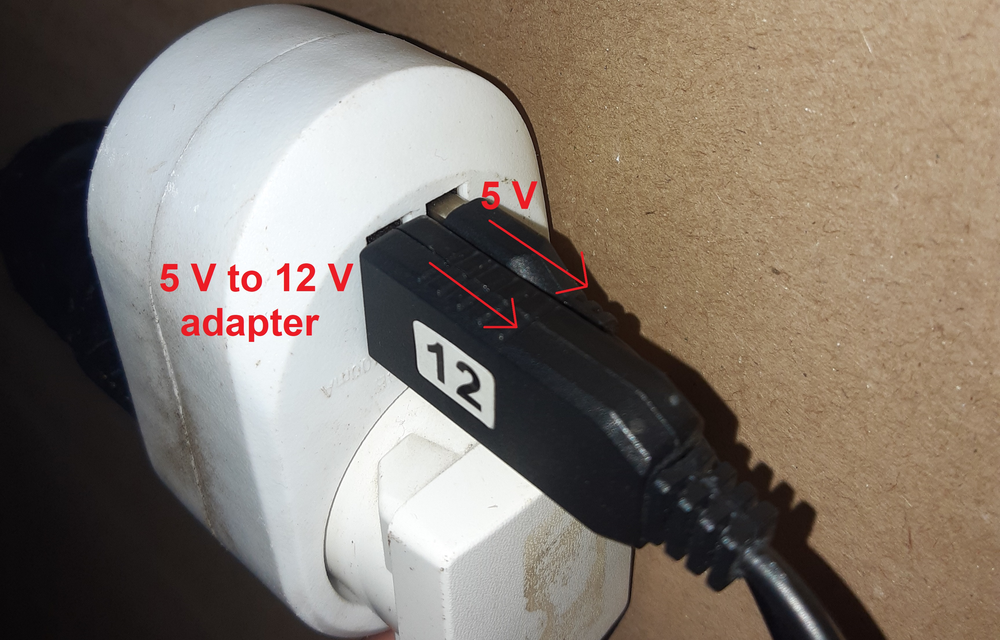
     Arduino shield is powered by 12 Volts (because of relays - If supplied with less than 7V, the 5V pin may supply less than five volts and the board may be unstable.) and GSM shield by 5 Volts.
     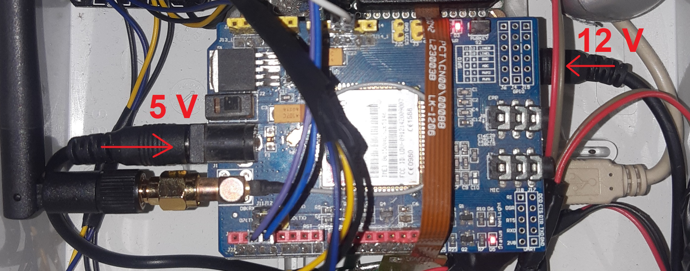
     I also replaced original antena.
     And added two capacitors (330uF and 100nF) to GSM shield.
     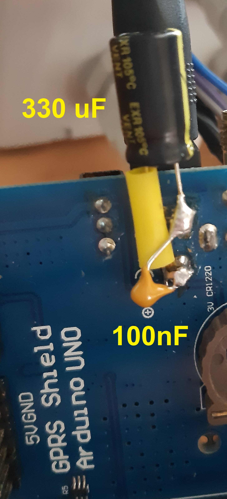
     C=I*t/U
     C=2A*0.0006s/5V (for 0.0006 second SIM900 module takes 2 Amps - from datasheet)
     C=0,00024=240uF (<- this should be the capacitor minimum value)
  </li>  
  <li>Result:
     
  </li>
  <li>Download the code, edit and run</li>
</ol>

## Links:
- https://randomnerdtutorials.com/sim900-gsm-gprs-shield-arduino/
- https://electronics.stackexchange.com/questions/123240/powering-sim-900-gsm
- https://industruino.com/page/wdt
- https://electronics.stackexchange.com/questions/102293/i-need-to-replace-this-button-in-this-circuit-board-with-a-relay
- https://www.laskakit.cz/user/related_files/gsm_manual_sim900_hardware_design_v2.pdf
- https://www.instructables.com/Powering-Arduino-with-a-Battery/
- https://www.elecrow.com/wiki/index.php?title=GPRS/GSM_Shield_v1.0
