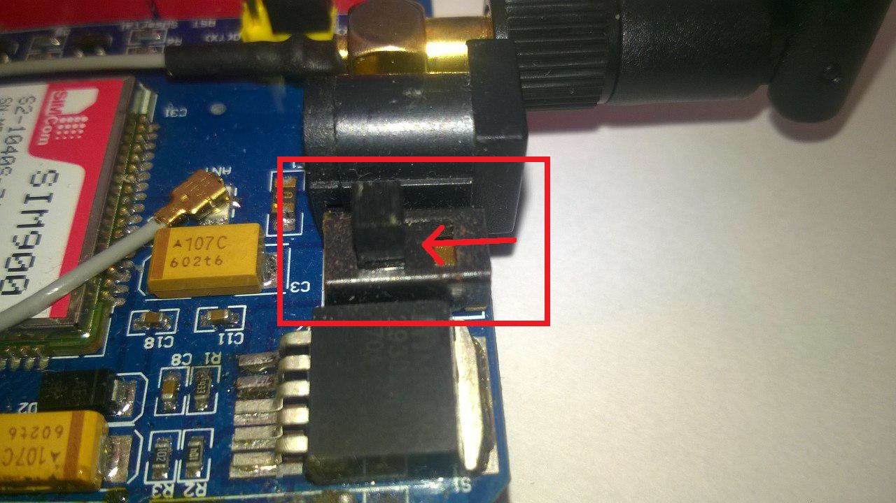
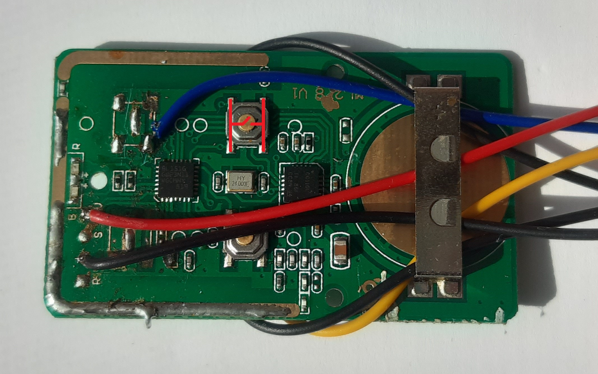

# Arduino SIM900 GPRS GSM Shield example - gate controller

## Setup
<ol>
  <li>Turn off the PIN lock on the SIM card (with a mobile phone)</li>
  <li>Choose TX and RX connections to the Arduino (I use software serial by placing the jumper caps on the left side of the serial selector. TX = D7, RX = D8)
     
  </li>
  <li>Solder R13 connections on the shield together (now you can automatically turn on/off the shield using arduino - GSM shield pin D9)
     
  </li>
  <li>Select the external power source with the toggle switch next to the DC jack (inner side - External power source/outter side - Power from arduino shield)
     
  </li>
  <li>Insert the SIM card into the SIM card holder</li>
  <li>Put GSM shield on the Arduino
     
  </li>
  <li>Modify your Gate controller (replace the buttons with wires from relays)
     
     Switch should be like this:
     
  </li>
  <li>Powering
     I had some problems with low power so I end up with 5V to arduino shield and 12V to GSM shield and a 2A usb charger.
     
     
     I also replaced original antena with one from 433MHz kit.
     
     And added two capacitors (330uF and 100nF).
     
  </li>
  <li>Download the code, edit and run</li>
</ol>

## Links:
- https://randomnerdtutorials.com/sim900-gsm-gprs-shield-arduino/
- https://electronics.stackexchange.com/questions/123240/powering-sim-900-gsm
- https://industruino.com/page/wdt
- https://electronics.stackexchange.com/questions/102293/i-need-to-replace-this-button-in-this-circuit-board-with-a-relay
